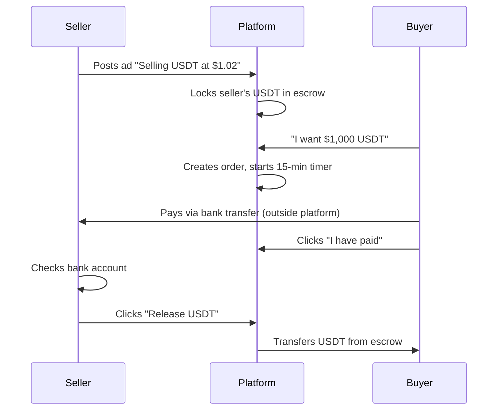

# 🌐 Universal P2P Marketplace Framework
## *Binance-Inspired Solution for Physical Goods*

> A white-label, open-source P2P marketplace system that can be deployed for ANY industry - from rice farmers to chicken suppliers, fabric manufacturers to electronics retailers.

---

## 🎯 **Core Philosophy**

**"Make it ridiculously simple for sellers, safe for buyers, and profitable for platforms."**

This framework adapts the proven Binance P2P model for physical goods, eliminating traditional escrow hassles while maintaining security through time-based automation and optional staking.

---

## 📋 **Table of Contents**

1. [How Binance P2P Works (Our Inspiration)](#how-binance-p2p-works)
2. [Adaptation for Physical Goods](#adaptation-for-physical-goods)
3. [Complete User Flow](#complete-user-flow)
4. [Trust & Security System](#trust-security-system)
5. [Technical Implementation](#technical-implementation)
6. [Configuration System](#configuration-system)
7. [Industry Templates](#industry-templates)
8. [Deployment Guide](#deployment-guide)

---

## 🎯 **How Binance P2P Works** (Our Inspiration)

Binance P2P processes billions in volume using this simple flow:

### **Core Binance Flow:**



**Key Insights:**
- ✅ **Seller's asset locked BEFORE buyer appears**
- ✅ **Payment happens outside platform**
- ✅ **Time limits prevent stalling**
- ✅ **Platform just facilitates and holds**

---

## 🔄 **Adaptation for Physical Goods**

### **Side-by-Side Comparison**

| Binance P2P | Our Physical Goods P2P |
|-------------|-------------------------|
| Sell crypto (USDT) | Sell rice/chicken/products |
| Lock USDT in escrow | Lock small stake (optional) |
| Buyer pays to seller's bank | Buyer pays to seller's bank/crypto/COD |
| Seller confirms payment received | Seller confirms payment received |
| Release USDT from escrow | Seller ships product |
| Buyer receives USDT | Buyer confirms delivery |
| Transaction complete | Seller's stake released |

### **"Advertisement" Model Instead of "Listings"**

```javascript
// Binance-style Advertisement
Advertisement = {
  seller: "FarmersUnion_TH",
  product: "Jasmine Rice",
  price: "$2.00/kg",
  minOrder: "100kg",
  maxOrder: "5000kg",
  
  // KEY: Seller specifies payment methods they accept
  paymentMethods: [
    "Bank Transfer (Bangkok Bank)",
    "USDT (TRC-20)",
    "PayPal",
    "Cash on Delivery"
  ],
  
  // Seller's terms
  terms: "Ship within 48hrs of payment confirmation",
  
  // Trust metrics (like Binance)
  stats: {
    ordersCompleted: 234,
    completionRate: "98.5%",
    avgShippingTime: "36 hours",
    positiveReviews: "95%"
  },
  
  // Optional: Seller stakes small deposit for verified badge
  stakeDeposit: "$200 USDT" // Released after order completion
}
```

---

## 🚀 **Complete User Flow** (Binance-Inspired)

### **Step 1: Seller Creates Advertisement**

```
Seller Dashboard:
┌─────────────────────────────────────────┐
│ CREATE ADVERTISEMENT                    │
├─────────────────────────────────────────┤
│ Product: Jasmine Rice                   │
│ Price: $2.00 per kg                     │
│ Available Quantity: 5000 kg             │
│                                         │
│ Min Order: 100 kg                       │
│ Max Order: 1000 kg                      │
│                                         │
│ Payment Methods I Accept:               │
│ ☑ Bank Transfer (share details later)  │
│ ☑ USDT (TRC-20)                         │
│ ☐ PayPal                                │
│ ☑ Cash on Delivery                      │
│                                         │
│ Shipping Time: 48 hours                 │
│                                         │
│ [Optional] Stake $100 for trust badge   │
│                                         │
│         [Publish Advertisement]         │
└─────────────────────────────────────────┘
```

**Result**: If seller stakes → Gets "Verified Seller" badge + higher placement

---

### **Step 2: Buyer Browses Ads (Like Binance)**

```
P2P Marketplace - Jasmine Rice
┌────────────────────────────────────────────────────┐
│ Filters: Min 100kg | Max $2.50/kg | Ships to: USA │
├────────────────────────────────────────────────────┤
│                                                    │
│ 🏆 FarmersUnion_TH     [Verified Seller]          │
│    $2.00/kg | Min: 100kg | Max: 1000kg            │
│    ⭐ 234 orders | 98.5% completion | Avg 36hrs   │
│    Accepts: Bank, USDT, COD                       │
│    Ships: Within 48hrs                            │
│                        [Buy]                      │
├────────────────────────────────────────────────────┤
│                                                    │
│ RiceFarm_VN                                        │
│    $1.95/kg | Min: 500kg | Max: 5000kg            │
│    ⭐ 45 orders | 91% completion | Avg 72hrs      │
│    Accepts: Bank Transfer only                    │
│    Ships: Within 72hrs                            │
│                        [Buy]                      │
├────────────────────────────────────────────────────┤
```

Buyer picks seller based on trust metrics (like choosing P2P trader on Binance).

---

### **Step 3: Order Creation (Timer Starts)**

```
Buyer clicks [Buy] on FarmersUnion_TH's ad:

┌─────────────────────────────────────────┐
│ CREATE ORDER                            │
├─────────────────────────────────────────┤
│ Quantity: [500] kg                      │
│ Total: $1,000 USD                       │
│                                         │
│ Choose Payment Method:                  │
│ ○ Bank Transfer                         │
│ ● USDT (TRC-20) ✓                       │
│ ○ Cash on Delivery                      │
│                                         │
│         [Confirm Order]                 │
└─────────────────────────────────────────┘

After clicking [Confirm]:
┌─────────────────────────────────────────┐
│ ⏱️ PAY WITHIN 30 MINUTES                │
├─────────────────────────────────────────┤
│ Order #12345 | Status: Pending Payment  │
│                                         │
│ Send USDT to:                           │
│ TRX Address: TQn9Y5...8Kx7               │
│ Amount: 1000 USDT                       │
│ Network: TRC-20 ⚠️                       │
│                                         │
│ After paying, click:                    │
│      [I Have Transferred Payment]       │
│                                         │
│ Time remaining: 28:45                   │
│                                         │
│ [Cancel Order] [Open Chat]              │
└─────────────────────────────────────────┘
```

**Seller sees**: "New order! Waiting for buyer to pay... ⏳"

---

### **Step 4: Buyer Pays & Marks "Paid"**

```
Buyer sends 1000 USDT to seller's wallet
Clicks [I Have Transferred Payment]

Buyer's view:
┌─────────────────────────────────────────┐
│ ✓ Payment Marked as Sent                │
├─────────────────────────────────────────┤
│ Waiting for seller to confirm payment   │
│ and ship the product...                 │
│                                         │
│ [Upload Payment Proof] (optional)       │
│ [Chat with Seller]                      │
│                                         │
│ If seller doesn't respond in 24hrs,     │
│ you can open a dispute.                 │
└─────────────────────────────────────────┘

Seller's view:
┌─────────────────────────────────────────┐
│ 🔔 BUYER CLAIMS PAYMENT SENT!           │
├─────────────────────────────────────────┤
│ Check your USDT wallet:                 │
│ TRX: TQn9Y5...8Kx7                       │
│                                         │
│ Expected: 1000 USDT                     │
│ Received: _____ USDT (check manually)   │
│                                         │
│ ✓ Payment confirmed?                    │
│   [Confirm & Ship Product]              │
│                                         │
│ ✗ Payment not received?                 │
│   [Open Dispute]                        │
│                                         │
│ [Chat with Buyer]                       │
└─────────────────────────────────────────┘
```

---

### **Step 5: Seller Confirms Payment & Ships**

```
Seller checks wallet → 1000 USDT arrived ✓
Clicks [Confirm & Ship Product]

┌─────────────────────────────────────────┐
│ CONFIRM SHIPMENT                        │
├─────────────────────────────────────────┤
│ Order #12345 | 500kg Jasmine Rice       │
│                                         │
│ Upload shipping proof:                  │
│ • Tracking number: [ABC123456]          │
│ • Courier: [DHL Express]                │
│ • Photo: [📷 Upload]                    │
│                                         │
│ Estimated delivery: [2024-10-15]        │
│                                         │
│         [Confirm Shipment]              │
└─────────────────────────────────────────┘

Buyer notification:
"✓ Seller confirmed payment and shipped! 
Track: ABC123456 (DHL)"
```

---

### **Step 6: Buyer Receives & Confirms**

```
Rice arrives at buyer's warehouse

Buyer's dashboard:
┌─────────────────────────────────────────┐
│ 📦 ORDER DELIVERED                      │
├─────────────────────────────────────────┤
│ Did you receive 500kg Jasmine Rice?     │
│                                         │
│ Quality check:                          │
│ ○ Excellent                             │
│ ○ Good                                  │
│ ○ Issues (explain)                      │
│                                         │
│ Upload delivery photos: [📷]            │
│                                         │
│ [Confirm Receipt]  [Report Issue]       │
│                                         │
│ ⏱️ Auto-confirm in 72 hours if no action│
└─────────────────────────────────────────┘

Clicks [Confirm Receipt]:
→ Seller's stake (if any) released
→ Order marked complete
→ Both parties can rate each other
```

---

## 🛡️ **Trust & Security System** (Binance-Style)

### **Seller Trust Metrics (Visible to Buyers)**

```
┌─────────────────────────────────────────┐
│ FarmersUnion_TH     [⭐ Verified]       │
├─────────────────────────────────────────┤
│ 📊 Statistics                           │
│ • Total Orders: 234                     │
│ • 30-Day Orders: 45                     │
│ • Completion Rate: 98.5%                │
│ • Avg Shipping Time: 36 hours           │
│                                         │
│ 💬 Ratings                              │
│ • Positive: 95% (223/234)               │
│ • Neutral: 3%                           │
│ • Negative: 2%                          │
│                                         │
│ ✅ Verified                             │
│ • KYC Verified                          │
│ • Business License                      │
│ • Stake Deposited: $500                 │
│                                         │
│ ⚡ Response Time: ~15 minutes            │
│ 🚚 Ships From: Thailand                 │
│ 📅 Member Since: Jan 2024               │
└─────────────────────────────────────────┘
```

### **Merchant Tier System**

```javascript
MerchantTiers = {
  "Regular": {
    minOrders: 0,
    benefits: "Basic listing"
  },
  
  "Verified Merchant": {
    minOrders: 50,
    completionRate: 95,
    stakeRequired: 500,
    benefits: [
      "Top placement in listings",
      "Verified badge",
      "Lower fees (1% vs 2%)",
      "Priority support"
    ]
  },
  
  "Premium Merchant": {
    minOrders: 500,
    completionRate: 98,
    stakeRequired: 5000,
    benefits: [
      "Everything above +",
      "Custom payment terms",
      "Bulk order tools",
      "API access",
      "0.5% fee"
    ]
  }
}
```

---

## ⚖️ **Dispute Resolution** (Binance-Style Appeals)

### **Dispute Dashboard**

```
Dispute #12345
┌─────────────────────────────────────────┐
│ DISPUTE DETAILS                         │
├─────────────────────────────────────────┤
│ Buyer claims: "Only received 450kg"     │
│ Seller claims: "Shipped full 500kg"     │
│                                         │
│ Evidence from Buyer:                    │
│ • Photo of weighing scale: 450kg        │
│ • Delivery receipt signed              │
│                                         │
│ Evidence from Seller:                   │
│ • Packing list: 500kg                   │
│ • Shipping weight: 520kg (with box)     │
│ • Courier receipt                       │
│                                         │
│ Platform Arbitrator Decision:           │
│ "Partial refund: $100 to buyer"         │
│ "Remaining stake released to seller"    │
│                                         │
│ Status: RESOLVED                        │
└─────────────────────────────────────────┘
```

---

## 💎 **Key Features from Binance to Copy**

### **1. Time Limits (Critical!)**
```javascript
timeLimits = {
  paymentWindow: 30,      // Buyer must pay in 30 min
  confirmPayment: 1440,   // Seller confirms in 24hrs or auto-dispute
  confirmDelivery: 4320,  // Buyer confirms in 3 days or auto-release
  disputeResponse: 2880   // Respond to dispute in 2 days
}
```

### **2. Auto-Actions (Prevents Stalling)**
```javascript
// Automatic order management
if (buyer.didNotPayInTime) {
  order.cancel();
  seller.stake.release();
}

if (seller.didNotConfirmPayment && buyer.hasProof) {
  openAutoDispute();
}

if (buyer.didNotConfirmDelivery && 3DaysPassed) {
  order.complete();
  seller.stake.release();
  seller.reputation.increase();
}
```

### **3. In-Order Chat System**
```javascript
Chat = {
  orderSpecific: true,
  autoMessages: [
    "Please send payment to...",
    "Payment confirmed, shipping today",
    "Tracking number: ...",
    "Product delivered, please confirm"
  ],
  fileUpload: true,  // Evidence photos
  encrypted: true,
  persistent: true   // Saved for disputes
}
```

---

## 🎨 **UI/UX Exactly Like Binance P2P**

### **Main P2P Marketplace Page**
```
┌──────────────────────────────────────────────────────┐
│ P2P Marketplace                      [Post Ad] [Orders]│
├──────────────────────────────────────────────────────┤
│                                                      │
│ Buy ○  Sell ●                                        │
│                                                      │
│ I want to buy: [Rice ▼]  Pay with: [USD ▼]          │
│                                                      │
│ Filters: Price | Payment | Region | Seller Rating   │
├──────────────────────────────────────────────────────┤
│                                                      │
│ Advertiser         | Price     | Limit    | Payment │
│ ──────────────────────────────────────────────────  │
│ FarmersUnion_TH ⭐ | $2.00/kg  | 100-1000 | Bank,   │
│ 234 orders | 98%   |           | kg       | USDT    │
│                                          [Buy Rice] │
│ ──────────────────────────────────────────────────  │
│ RiceFarm_VN       | $1.95/kg  | 500-5000 | Bank    │
│ 45 orders | 91%    |           | kg       | only    │
│                                          [Buy Rice] │
└──────────────────────────────────────────────────────┘
```

---

## 🔧 **Technical Implementation**

### **Smart Contracts**

```solidity
// Core contracts
contract P2PMarketplace {
    struct Advertisement {
        address seller;
        string productType;
        uint256 pricePerUnit;
        uint256 minOrder;
        uint256 maxOrder;
        string[] paymentMethods;
        bool isActive;
        uint256 stakeAmount;
    }
    
    struct Order {
        uint256 adId;
        address buyer;
        address seller;
        uint256 quantity;
        uint256 totalPrice;
        OrderStatus status;
        uint256 createdAt;
        uint256 paymentDeadline;
    }
    
    enum OrderStatus {
        CREATED,
        PAYMENT_PENDING,
        PAYMENT_CONFIRMED,
        SHIPPED,
        DELIVERED,
        DISPUTED,
        COMPLETED,
        CANCELLED
    }
}
```

### **Backend Architecture**

```
backend/
├── controllers/
│   ├── advertisements.js      # CRUD for ads
│   ├── orders.js             # Order state machine
│   ├── chat.js               # Real-time messaging
│   └── disputes.js           # Appeal system
│
├── middleware/
│   ├── timeouts.js           # Auto-cancel/release
│   ├── auth.js               # Wallet verification
│   └── validation.js         # Input sanitization
│
├── services/
│   ├── blockchain.js         # Web3 interactions
│   ├── notifications.js      # Email/push notifications
│   └── reputation.js         # Trust score calculation
│
└── config/
    ├── industries/           # Industry-specific configs
    │   ├── agriculture.json
    │   ├── electronics.json
    │   └── textiles.json
    └── chains/               # Blockchain configs
        ├── ethereum.json
        ├── polygon.json
        └── arbitrum.json
```

### **Frontend Stack**

```
frontend/
├── components/
│   ├── Marketplace/          # Main P2P interface
│   ├── AdCreation/          # Post advertisement
│   ├── OrderFlow/           # Binance-style order process
│   ├── Chat/                # Real-time messaging
│   └── Disputes/            # Appeal system
│
├── hooks/
│   ├── useTimer.js          # Countdown timers
│   ├── useWebSocket.js      # Real-time updates
│   └── useWeb3.js           # Blockchain interactions
│
└── config/
    └── marketplace.config.js # Industry customization
```

---

## ⚙️ **Configuration System** (White-Label Ready)

### **Industry Template Example**

```javascript
// config/industries/agriculture.json
{
  "marketplace": {
    "name": "AgriConnect",
    "tagline": "Direct Farm to Business",
    "categories": [
      {
        "name": "Grains",
        "subcategories": ["Rice", "Wheat", "Corn", "Barley"]
      },
      {
        "name": "Vegetables", 
        "subcategories": ["Tomatoes", "Potatoes", "Onions"]
      }
    ],
    
    "units": ["kg", "tons", "bags", "crates"],
    "currencies": ["USD", "EUR", "USDT", "USDC"],
    
    "customFields": {
      "listings": [
        {
          "name": "origin",
          "type": "string",
          "required": true,
          "label": "Farm Location"
        },
        {
          "name": "organic",
          "type": "boolean", 
          "required": false,
          "label": "Organic Certified"
        },
        {
          "name": "harvestDate",
          "type": "date",
          "required": true,
          "label": "Harvest Date"
        }
      ]
    }
  },
  
  "orderFlow": {
    "requiresEscrow": false,
    "timeouts": {
      "payment": 30,        // 30 minutes to pay
      "confirmation": 1440, // 24 hours to confirm payment
      "delivery": 10080     // 7 days to confirm delivery
    },
    
    "milestones": [
      {
        "trigger": "payment_confirmed",
        "action": "notify_ship"
      },
      {
        "trigger": "shipped", 
        "action": "start_delivery_timer"
      }
    ]
  },
  
  "ui": {
    "theme": {
      "primary": "#22c55e",     // Green for agriculture
      "secondary": "#16a34a"
    },
    "images": {
      "hero": "/images/farm-hero.jpg",
      "placeholder": "/images/grain-placeholder.jpg"
    }
  }
}
```

### **Deployment Configuration**

```javascript
// config/deployment.config.js
module.exports = {
  // Industry selection
  industry: "agriculture", // or "electronics", "textiles", etc.
  
  // Blockchain settings
  blockchain: {
    network: "polygon",      // ethereum, arbitrum, base
    testnet: false,
    contracts: {
      marketplace: "0x...",
      escrow: "0x...",
      disputes: "0x..."
    }
  },
  
  // Business settings
  fees: {
    platform: 2.0,         // 2% platform fee
    verified: 1.0,          // 1% for verified merchants
    premium: 0.5            // 0.5% for premium merchants
  },
  
  // Payment integrations
  payments: {
    stripe: true,
    paypal: true,
    crypto: ["USDT", "USDC", "ETH"],
    fiat: ["USD", "EUR", "GBP"]
  }
}
```

---

## 📋 **Industry Templates**

### **🌾 Agriculture Template**
- **Products**: Rice, wheat, vegetables, fruits
- **Units**: kg, tons, bags, crates
- **Custom Fields**: Origin, organic certification, harvest date
- **Payment**: Bank transfer, crypto, cash on delivery
- **Shipping**: 24-48 hours typical

### **🐔 Livestock Template** 
- **Products**: Chickens, eggs, dairy, meat
- **Units**: pieces, dozens, kg
- **Custom Fields**: Breed, age, vaccination status
- **Payment**: Bank transfer, crypto
- **Shipping**: Live animals (special handling)

### **📱 Electronics Template**
- **Products**: Phones, laptops, components
- **Units**: pieces, sets, pallets
- **Custom Fields**: Brand, model, warranty, condition
- **Payment**: Crypto preferred (international)
- **Shipping**: 2-5 days, insured

### **🧵 Textiles Template**
- **Products**: Fabric, clothing, raw materials
- **Units**: meters, rolls, pieces
- **Custom Fields**: Material, pattern, color, GSM
- **Payment**: Bank transfer, letters of credit
- **Shipping**: 3-7 days

---

## 🚀 **Deployment Guide**

### **Option 1: Quick Deploy (Docker)**

```bash
# 1. Clone the framework
git clone https://github.com/your-org/p2p-marketplace-framework
cd p2p-marketplace-framework

# 2. Configure for your industry
cp config/industries/agriculture.json config/active.json
nano config/active.json  # Customize

# 3. Deploy with Docker
docker-compose up -d

# 4. Deploy smart contracts
npm run deploy:contracts -- --network polygon

# 5. Your marketplace is live!
open http://localhost:3000
```

### **Option 2: Custom Deployment**

```bash
# 1. Install dependencies
npm install

# 2. Configure environment
cp .env.example .env
nano .env  # Add your API keys, RPC URLs

# 3. Configure industry
nano config/marketplace.config.js

# 4. Deploy contracts
npx hardhat deploy --network mainnet

# 5. Start services
npm run start:backend &
npm run start:frontend &

# 6. Configure domain and SSL
# Point your domain to the server
# Set up SSL certificate
```

### **Environment Variables**

```bash
# .env file
MONGODB_URI=mongodb://localhost:27017/p2p-marketplace
REDIS_URL=redis://localhost:6379

# Blockchain
ETHEREUM_RPC_URL=https://eth-mainnet.alchemyapi.io/v2/your-key
POLYGON_RPC_URL=https://polygon-rpc.com
PRIVATE_KEY=your-deployer-private-key

# Services
IPFS_API_KEY=your-pinata-key
SENDGRID_API_KEY=your-sendgrid-key
STRIPE_SECRET_KEY=your-stripe-key

# Industry Config
INDUSTRY_TEMPLATE=agriculture
MARKETPLACE_NAME="AgriConnect"
BASE_CURRENCY=USD
```

---

## 🔥 **Why This Model is PERFECT**

### **✅ For Sellers (Farmers, Manufacturers)**
- **Zero barriers**: Email + wallet = ready to sell
- **Fast payment**: No funds locked, direct payment
- **Simple process**: Post ad → Receive payment → Ship → Done
- **Optional verification**: Stake only if you want perks

### **✅ For Buyers (Businesses, Retailers)**  
- **Safe purchases**: See seller history before buying
- **Flexible payment**: Choose your preferred method
- **Time protection**: Can't be ghosted (auto-actions)
- **Dispute resolution**: Platform arbitration available

### **✅ For Platform Operators**
- **Proven model**: Based on Binance's billion-dollar system
- **Low risk**: No custody of funds (payment outside platform)
- **Scalable**: Time-based automation reduces support
- **Profitable**: 1-2% fees on successful transactions

### **✅ For Developers**
- **Open source**: Fork and customize for any industry
- **Modular**: Pick and choose components
- **Well documented**: Clear deployment guides
- **Community driven**: Contribute improvements back

---

## 📊 **Success Metrics**

Track these KPIs to measure success:

```javascript
Metrics = {
  // Volume metrics
  totalGMV: "Gross Merchandise Volume",
  dailyOrders: "Orders per day",
  averageOrderValue: "AOV by category",
  
  // Trust metrics  
  completionRate: "% of orders completed",
  disputeRate: "% of orders disputed",
  resolutionTime: "Average dispute resolution time",
  
  // User metrics
  sellerRetention: "% of sellers with repeat listings",
  buyerRetention: "% of buyers with repeat orders", 
  verificationRate: "% of users who complete KYC",
  
  // Platform metrics
  responseTime: "Average platform response time",
  uptime: "Platform availability",
  supportTickets: "Customer support volume"
}
```

---

## 🤝 **Contributing**

This is an open-source project! Ways to contribute:

1. **Industry Templates**: Add new industry configurations
2. **Payment Integrations**: Add support for new payment methods
3. **UI Components**: Improve the user interface
4. **Smart Contracts**: Enhance security and efficiency
5. **Documentation**: Help others deploy the system
6. **Bug Reports**: Report issues you encounter
7. **Feature Requests**: Suggest improvements

---

## 📞 **Support & Community**

- **Documentation**: [docs.p2p-framework.com](https://docs.p2p-framework.com)
- **Discord**: [Join our community](https://discord.gg/p2p-framework)
- **GitHub**: [Report issues](https://github.com/your-org/p2p-marketplace-framework/issues)
- **Email**: support@p2p-framework.com

---

## 📝 **License**

MIT License - Fork it, modify it, deploy it! 

This framework is designed to be **truly open source** - anyone can use it to build their own P2P marketplace for any industry.

---

## 🎯 **Next Steps**

Ready to build your P2P marketplace? 

1. **Star this repo** ⭐
2. **Choose your industry** (agriculture, electronics, textiles, etc.)
3. **Follow the deployment guide** 
4. **Customize for your market**
5. **Launch and grow** 🚀

**The future of commerce is P2P. Let's build it together!** 💪