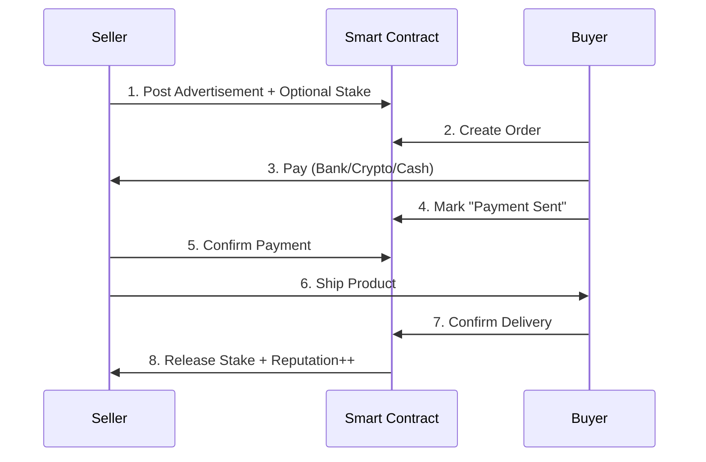

# 🌐 Universal P2P Marketplace Framework

> **Binance-inspired marketplace for ANY industry** - From rice farmers to electronics retailers. Open-source, trustless, and production-ready.

[](https://opensource.org/licenses/MIT)
[](https://nextjs.org/)
[](https://www.typescriptlang.org/)
[](https://tailwindcss.com/)

---

## 🎯 What Is This?

A **white-label P2P marketplace framework** that adapts Binance's proven P2P trading model for **physical goods**. Whether you're selling rice, chickens, electronics, or textiles - this framework provides everything you need to create a trustless, secure marketplace.

### **The Problem We Solve**

Traditional marketplaces (Amazon, Alibaba, etc.) create monopolies by:
- ❌ Taking 15-40% fees
- ❌ Controlling seller-buyer relationships
- ❌ Holding your funds in escrow
- ❌ Making arbitrary rules

### **Our Solution**

A **peer-to-peer marketplace** where:
- ✅ **0% platform fees** (optional staking for verification)
- ✅ **Direct transactions** between buyers and sellers
- ✅ **Trustless escrow** via smart contracts
- ✅ **On-chain reputation** that can't be faked
- ✅ **Any payment method** (bank, crypto, cash on delivery)
- ✅ **Open source** - fork it, customize it, own it

---

## 🚀 How It Works

### **Binance P2P Model Applied to Physical Goods**



### **Key Mechanisms**

#### **1. Advertisement Model** (Not Traditional Listings)
Sellers post "advertisements" with their terms:
- Product & price
- Min/max order quantity  
- Accepted payment methods
- Shipping time commitment

Buyers browse and choose sellers based on **reputation, price, and terms**.

#### **2. Time-Based Automation**
- ⏱️ **30 minutes**: Buyer must pay or order auto-cancels
- ⏱️ **24 hours**: Seller must confirm payment or buyer can dispute
- ⏱️ **7 days**: Funds auto-release if buyer doesn't confirm delivery
- ⏱️ **48 hours**: Disputes must be resolved or escalated

#### **3. Trust Through Transparency**
Every seller has a public reputation showing:
- Total orders completed
- Completion rate (%)
- Average shipping time
- Positive/negative reviews
- Stake amount (skin in the game)

#### **4. Flexible Payment**
Unlike traditional escrow platforms:
- **Crypto**: Trustless escrow via smart contracts
- **Bank Transfer**: Seller provides account, buyer pays directly
- **Cash on Delivery**: Payment on receipt
- **PayPal/Venmo**: Modern payment rails

#### **5. Decentralized Disputes**
If something goes wrong:
- Upload evidence to IPFS (immutable)
- Decentralized arbitrators review (Kleros integration)
- Community voting or staked arbitrators decide
- Losing party pays arbitration costs

---

## 💻 For Developers: Setup

### **Prerequisites**

- Node.js 18+
- npm or yarn
- Git

### **Quick Start**

```bash
# 1. Clone the repository
git clone https://github.com/slubbles/p2p-system.git
cd p2p-system

# 2. Install dependencies
cd frontend
npm install

# 3. Run development server
npm run dev

# 4. Open in browser
# Visit http://localhost:3000
```

### **Project Structure**

```
p2p-system/
├── frontend/                          # Next.js application
│   ├── src/
│   │   ├── app/                      # App router
│   │   │   ├── layout.tsx            # Root layout
│   │   │   ├── page.tsx              # Homepage
│   │   │   └── globals.css           # Global styles
│   │   └── components/               # React components
│   │       ├── ui/                   # shadcn/ui components
│   │       ├── navigation.tsx        # Navigation bar
│   │       ├── hero.tsx              # Hero section
│   │       ├── features.tsx          # Features grid
│   │       ├── industry-showcase.tsx # Industry templates
│   │       ├── cta.tsx               # Call to action
│   │       └── footer.tsx            # Footer
│   │
│   ├── components.json               # shadcn/ui config
│   ├── tailwind.config.ts            # Tailwind config
│   └── package.json                  # Dependencies
│
├── P2P_MARKETPLACE_FRAMEWORK.md      # Complete framework docs
├── TRUSTLESS_ARCHITECTURE.md         # Blockchain architecture
├── QUICK_START_TRUSTLESS.md          # Quick implementation guide
└── README.md                         # You are here
```

### **Development Commands**

```bash
# Start dev server with hot reload
npm run dev

# Build for production
npm run build

# Start production server
npm start

# Lint code
npm run lint

# Add shadcn/ui components
npx shadcn@latest add [component-name]
```

### **Tech Stack**

| Technology | Purpose |
|------------|---------|
| Next.js 15 | React framework with App Router |
| TypeScript | Type safety |
| Tailwind CSS v4 | Styling |
| shadcn/ui | Component library |
| Geist Font | Typography (Vercel's font) |

### **Customization**

#### Change Color Theme
Edit `frontend/src/app/globals.css`:
```css
:root {
  --background: 0 0% 100%;  /* White */
  --foreground: 0 0% 0%;    /* Black */
  /* ... */
}
```

#### Add Industry Template
See `P2P_MARKETPLACE_FRAMEWORK.md` for industry configuration examples.

---

## 🎨 Design Philosophy

**Vercel-Inspired Minimalism**
- Pure black & white color scheme
- Geist font family
- Clean, spacious layouts
- Smooth transitions
- Mobile-first responsive design

**Why No Colors?**
Like Vercel, we believe:
- Clarity > decoration
- Speed > flashiness  
- Content > chrome

---

## 👥 For Users: Benefits

### **If You're a Seller** (Farmer, Manufacturer, Supplier)

#### **Save Money**
- ❌ **Traditional**: 15-40% fees to Amazon/Alibaba
- ✅ **P2P Marketplace**: 0-2% optional fees

**Example**: Sell $100,000/year of rice
- Traditional: Lose $15,000-$40,000 to fees
- P2P: Pay $0-$2,000 (optional verification stake)
- **Savings: $13,000-$40,000/year**

#### **Keep Control**
- Set your own prices
- Choose payment methods YOU prefer
- Direct relationship with buyers
- No arbitrary rule changes

#### **Build Portable Reputation**
Your reputation is **on-chain** (blockchain):
- Can't be deleted by platform
- You own it forever
- Take it to other marketplaces
- Verifiable by anyone

---

### **If You're a Buyer** (Business, Retailer, Consumer)

#### **Better Prices**
Sellers save on fees → Pass savings to you
- Direct from producers
- No middleman markup
- Competitive marketplace

#### **More Trust**
- **Transparent history**: See every seller's full track record
- **Staking**: Verified sellers put money where their mouth is
- **On-chain reputation**: Can't be faked or bought
- **Dispute resolution**: Fair arbitration if something goes wrong

#### **More Options**
- Choose payment method YOU prefer
- Filter by reputation, price, location
- Direct communication with seller
- Community-driven platform

---

### **If You're a Platform Operator**

#### **Zero Infrastructure Costs**
- No database to maintain (blockchain is the database)
- No payment processing (direct peer-to-peer)
- No escrow liability (smart contracts handle it)
- No customer support for "where's my money?" (it's on-chain)

#### **Unstoppable**
- No single point of failure
- Can't be shut down
- Can't be censored
- Open source = anyone can host

#### **Network Effects**
- Reputation follows users across instances
- Shared liquidity
- Fork-friendly (improve and compete!)

---

## 🔐 Security & Trust

### **How Is This Trustless?**

**Traditional Marketplace:**
```
You → Platform (trust required) → Seller
     ↑
  Holds your money
  Controls your data
  Makes the rules
```

**P2P Marketplace:**
```
You → Smart Contract (no trust needed) → Seller
     ↑
  Open source code
  Cryptographic proofs
  Community governance
```

### **Key Security Features**

1. **Smart Contract Escrow**
   - Funds locked on blockchain
   - Released only when both parties agree
   - Auto-release after timeout (no stalling)

2. **On-Chain Reputation**
   - Stored on blockchain (immutable)
   - Verifiable by anyone
   - Can't be deleted or faked

3. **Economic Security**
   - Sellers stake collateral
   - Bad behavior = lose stake (slashing)
   - Good behavior = earn reputation

4. **Encrypted Communication**
   - Wallet-to-wallet messaging (XMTP)
   - Payment details shared securely
   - Chat history for disputes

5. **Decentralized Arbitration**
   - Community or professional arbitrators
   - Evidence stored on IPFS
   - Fair voting mechanism
   - Appeals process

---

## 📋 Industry Templates

Pre-configured for popular industries (easily customizable):

### 🌾 **Agriculture**
- Products: Rice, wheat, vegetables, fruits
- Payment: Bank transfer, crypto, cash on delivery
- Use case: Farmers selling direct to retailers

### 🐔 **Livestock**
- Products: Eggs, dairy, meat, live animals
- Payment: Bank transfer, crypto
- Use case: Farm to restaurant supply chain

### 📱 **Electronics**
- Products: Phones, laptops, components
- Payment: Crypto preferred (international)
- Use case: Wholesale electronics trading

### 🧵 **Textiles**
- Products: Fabric, clothing, raw materials
- Payment: Bank transfer, letters of credit
- Use case: Manufacturer to retailer

**Don't see your industry?**
The framework is fully customizable - configure for ANY product category.

---

## 🗺️ Roadmap

### ✅ **Phase 1: MVP (Current)**
- [x] Next.js frontend with Vercel design
- [x] Responsive mobile-first UI
- [x] Component library (shadcn/ui)
- [x] Framework documentation
- [x] Architecture design

### 🔄 **Phase 2: Blockchain Integration** (Next)
- [ ] Smart contract development (Solidity)
- [ ] Wallet integration (RainbowKit)
- [ ] IPFS integration (Pinata)
- [ ] The Graph indexer
- [ ] Testnet deployment

### 📅 **Phase 3: Advanced Features**
- [ ] Encrypted messaging (XMTP)
- [ ] Dispute resolution (Kleros)
- [ ] Multi-chain support
- [ ] Mobile app (React Native)
- [ ] DAO governance

### 🚀 **Phase 4: Ecosystem**
- [ ] Developer SDK
- [ ] Industry plugins
- [ ] Reputation NFTs
- [ ] Cross-marketplace reputation
- [ ] Zero-knowledge privacy features

---

## 📚 Documentation

- **[P2P_MARKETPLACE_FRAMEWORK.md](./P2P_MARKETPLACE_FRAMEWORK.md)** - Complete framework specification (30+ pages)
- **[TRUSTLESS_ARCHITECTURE.md](./TRUSTLESS_ARCHITECTURE.md)** - Blockchain architecture deep-dive
- **[QUICK_START_TRUSTLESS.md](./QUICK_START_TRUSTLESS.md)** - Quick implementation guide
- **[SETUP_COMPLETE.md](./SETUP_COMPLETE.md)** - Initial setup summary
- **[frontend/DESIGN_GUIDE.md](./frontend/DESIGN_GUIDE.md)** - UI/UX design system

---

## 🤝 Contributing

We welcome contributions! Here's how:

### **For Developers**
```bash
# 1. Fork the repository
# 2. Create feature branch
git checkout -b feature/amazing-feature

# 3. Commit changes
git commit -m 'Add amazing feature'

# 4. Push to branch
git push origin feature/amazing-feature

# 5. Open Pull Request
```

### **Areas We Need Help**
- 🔧 Smart contract development
- 🎨 UI/UX improvements
- 📝 Documentation
- 🌍 Translations
- 🐛 Bug reports
- 💡 Feature suggestions

---

## 📄 License

MIT License - see [LICENSE](./LICENSE) file

**What This Means:**
- ✅ Use commercially
- ✅ Modify freely
- ✅ Distribute
- ✅ Private use
- ✅ **No attribution required** (but appreciated!)

---

## 🌟 Why This Matters

### **The Bigger Picture**

**Problem**: Centralized marketplaces create monopolies
- Amazon takes 15-40% fees
- Controls seller-buyer relationships
- Arbitrary rules and bans
- Your reputation is their property

**Solution**: Decentralized, community-owned marketplaces
- Near-zero fees
- Direct peer-to-peer
- Transparent rules (smart contracts)
- Portable reputation (blockchain)

**Impact**: Empower producers and consumers
- Farmers get fair prices
- Consumers get better deals
- Communities build local economies
- Open-source prevents monopolies

---

## 📞 Contact & Community

- **GitHub Issues**: [Report bugs or request features](https://github.com/slubbles/p2p-system/issues)
- **Discussions**: [Join the conversation](https://github.com/slubbles/p2p-system/discussions)
- **Twitter**: [@slubbles](https://twitter.com/slubbles)
- **Email**: [Your email here]

---

## 🙏 Acknowledgments

**Inspired By:**
- [Binance P2P](https://p2p.binance.com/) - Proof that P2P marketplaces work at scale
- [LocalBitcoins](https://localbitcoins.com/) - Pioneer of P2P crypto trading
- [Vercel](https://vercel.com/) - Design philosophy and Geist font
- [shadcn/ui](https://ui.shadcn.com/) - Beautiful component library

**Built With:**
- [Next.js](https://nextjs.org/)
- [Tailwind CSS](https://tailwindcss.com/)
- [TypeScript](https://www.typescriptlang.org/)
- [Solidity](https://soliditylang.org/) (coming soon)

---

## ⭐ Star Us!

If you find this useful, please star the repo! It helps others discover the project.

**Together, we can break monopolies and build truly open marketplaces.** 🚀

---

<div align="center">

**Made with ❤️ by the community, for the community**

[⬆ Back to Top](#-universal-p2p-marketplace-framework)

</div>
