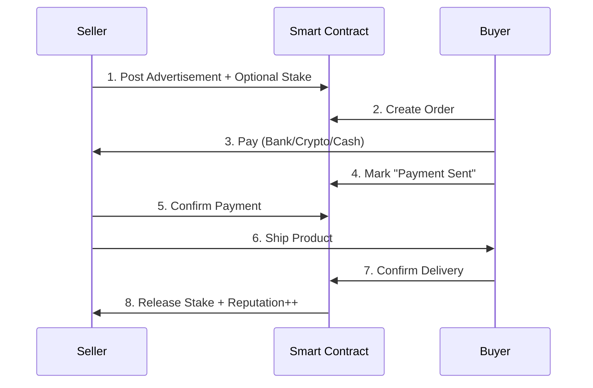
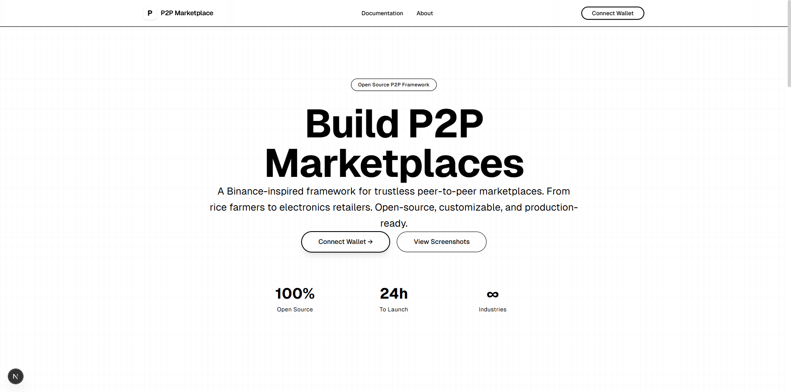
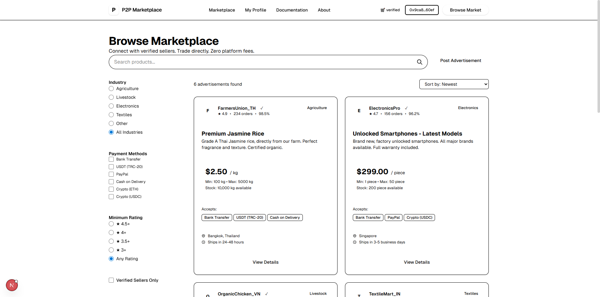
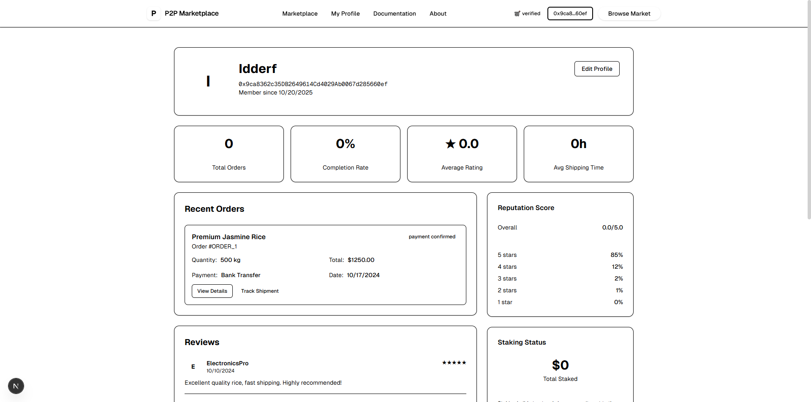
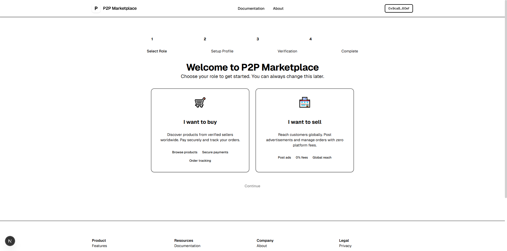

<div align="center">

# 🛒 Universal P2P Marketplace Framework


### 🌾 **From rice farmers to electronics retailers** · Zero platform fees · Open-source

**A Binance P2P-inspired marketplace framework for ANY industry**

[🚀 Live Demo](http://localhost:3003) · [📚 Documentation](./TRUSTLESS_ARCHITECTURE.md) · [🐛 Report Bug](https://github.com/slubbles/p2p-system/issues) · [⭐ Star on GitHub](https://github.com/slubbles/p2p-system)

</div>

---

## 📌 Project Status

<div align="center">

**🎯 Type:** Technical demonstration (75% complete)  
**💼 Purpose:** Showcase full-stack Web3 development skills  
**✨ Functionality:** Working authentication, onboarding, marketplace browsing

| Resource | Link |
|----------|------|
| � Frontend Docs | [frontend/README.md](frontend/README.md) |
| 🚀 Deployment Guide | [NETLIFY_DEPLOYMENT.md](NETLIFY_DEPLOYMENT.md) |
| ⚡ Quick Reference | [NETLIFY_QUICK_REFERENCE.md](NETLIFY_QUICK_REFERENCE.md) |
| 🏗️ Architecture | [TRUSTLESS_ARCHITECTURE.md](TRUSTLESS_ARCHITECTURE.md) |

</div>

---

## 🎯 What Is This?

A **white-label P2P marketplace framework** that adapts Binance's proven P2P trading model for **physical goods**. Whether you're selling rice, chickens, electronics, or textiles - this framework provides everything you need to create a trustless, secure marketplace.

<div align="center">

### ✨ Features at a Glance

| 🔐 Web3 Auth | 📢 Ads Model | ⏰ Automation | ⭐ Reputation | 💳 Payments | 🎨 Templates |
|:---:|:---:|:---:|:---:|:---:|:---:|
| 300+ wallets | Post offers | Auto-cancel | On-chain | Any method | 5+ industries |

</div>

### **The Problem We Solve**

Traditional marketplaces (Amazon, Alibaba, etc.) create monopolies by:
- ❌ Taking 15-40% fees
- ❌ Controlling seller-buyer relationships
- ❌ Holding your funds in escrow
- ❌ Making arbitrary rules

### **Our Solution**

A **peer-to-peer marketplace** where:
- ✅ **0% platform fees** (optional staking for verification)
- ✅ **Direct transactions** between buyers and sellers
- ✅ **Trustless escrow** via smart contracts
- ✅ **On-chain reputation** that can't be faked
- ✅ **Any payment method** (bank, crypto, cash on delivery)
- ✅ **Open source** - fork it, customize it, own it

---

## 🚀 How It Works

### **Binance P2P Model Applied to Physical Goods**



### **Key Mechanisms**

#### **1. Advertisement Model** (Not Traditional Listings)
Sellers post "advertisements" with their terms:
- Product & price
- Min/max order quantity  
- Accepted payment methods
- Shipping time commitment

Buyers browse and choose sellers based on **reputation, price, and terms**.

#### **2. Time-Based Automation**
- ⏱️ **30 minutes**: Buyer must pay or order auto-cancels
- ⏱️ **24 hours**: Seller must confirm payment or buyer can dispute
- ⏱️ **7 days**: Funds auto-release if buyer doesn't confirm delivery
- ⏱️ **48 hours**: Disputes must be resolved or escalated

#### **3. Trust Through Transparency**
Every seller has a public reputation showing:
- Total orders completed
- Completion rate (%)
- Average shipping time
- Positive/negative reviews
- Stake amount (skin in the game)

#### **4. Flexible Payment**
Unlike traditional escrow platforms:
- **Crypto**: Trustless escrow via smart contracts
- **Bank Transfer**: Seller provides account, buyer pays directly
- **Cash on Delivery**: Payment on receipt
- **PayPal/Venmo**: Modern payment rails

#### **5. Decentralized Disputes**
If something goes wrong:
- Upload evidence to IPFS (immutable)
- Decentralized arbitrators review (Kleros integration)
- Community voting or staked arbitrators decide
- Losing party pays arbitration costs

---

## 💻 For Developers: Setup

<div align="center">

### ⚡ Quick Start in 3 Steps

</div>

```bash
# 1️⃣ Clone & Install
git clone https://github.com/slubbles/p2p-system.git
cd p2p-system/frontend && npm install

# 2️⃣ Configure Environment
cp .env.local.example .env.local
# Add your WalletConnect Project ID (get free at https://cloud.reown.com/)

# 3️⃣ Run Development Server
npm run dev
# 🎉 Visit http://localhost:3000
```

<div align="center">

**Need a WalletConnect ID?** → [Get one free in 2 minutes](https://cloud.reown.com/) 🚀

</div>

### **Prerequisites**

- Node.js 18+ and npm
- Git
- A Web3 wallet (MetaMask, Rainbow, etc.) for testing

### **Project Structure**

```
p2p-system/
├── frontend/                          # Next.js application
│   ├── src/
│   │   ├── app/                      # App router
│   │   │   ├── layout.tsx            # Root layout
│   │   │   ├── page.tsx              # Homepage
│   │   │   └── globals.css           # Global styles
│   │   └── components/               # React components
│   │       ├── ui/                   # shadcn/ui components
│   │       ├── navigation.tsx        # Navigation bar
│   │       ├── hero.tsx              # Hero section
│   │       ├── features.tsx          # Features grid
│   │       ├── industry-showcase.tsx # Industry templates
│   │       ├── cta.tsx               # Call to action
│   │       └── footer.tsx            # Footer
│   │
│   ├── components.json               # shadcn/ui config
│   ├── tailwind.config.ts            # Tailwind config
│   └── package.json                  # Dependencies
│
├── P2P_MARKETPLACE_FRAMEWORK.md      # Complete framework docs
├── TRUSTLESS_ARCHITECTURE.md         # Blockchain architecture
├── QUICK_START_TRUSTLESS.md          # Quick implementation guide
└── README.md                         # You are here
```

### **Development Commands**

```bash
# Start dev server with hot reload
npm run dev

# Build for production
npm run build

# Start production server
npm start

# Lint code
npm run lint

# Add shadcn/ui components
npx shadcn@latest add [component-name]
```

### **Tech Stack**

<div align="center">

| **Frontend** | **Web3** | **Styling** | **Tools** |
|:---:|:---:|:---:|:---:|
| ⚛️ React 19 | 🔗 wagmi v2 | 🎨 Tailwind v4 | 📦 TypeScript 5 |
| ⚡ Next.js 15 | 🌐 viem v2 | 🧩 shadcn/ui | 🔄 App Router |
| 🎭 Server Components | 💼 WalletConnect 2 | 🖋️ Geist Font | 📱 Responsive |

**Architecture:** Next.js App Router + React Server Components + Client Components  
**Deployment:** Netlify-ready (Vercel compatible)  
**State Management:** React Context API + TanStack Query (coming)

</div>

### **Customization**

#### Change Color Theme
Edit `frontend/src/app/globals.css`:
```css
:root {
  --background: 0 0% 100%;  /* White */
  --foreground: 0 0% 0%;    /* Black */
  /* ... */
}
```

#### Add Industry Template
See `P2P_MARKETPLACE_FRAMEWORK.md` for industry configuration examples.

---

## 📸 Screenshots

<div align="center">

### 🏠 Homepage
*Vercel-inspired minimalist design with clear value proposition*



### 🛒 Marketplace
*Browse advertisements with advanced filtering and search*



### 👤 User Profile
*Comprehensive dashboard with stats, reputation, and order history*



### 🚀 Onboarding
*Smooth first-time user experience with role selection*



**Want to see it in action?** → [Visit /demo page](http://localhost:3005/demo) for live showcase!

</div>

---

## 🎨 Design Philosophy

**Vercel-Inspired Minimalism**
- Pure black & white color scheme
- Geist font family
- Clean, spacious layouts
- Smooth transitions
- Mobile-first responsive design

**Why No Colors?**
Like Vercel, we believe:
- Clarity > decoration
- Speed > flashiness  
- Content > chrome

---

## 👥 For Users: Benefits

### **If You're a Seller** (Farmer, Manufacturer, Supplier)

#### **Save Money**
- ❌ **Traditional**: 15-40% fees to Amazon/Alibaba
- ✅ **P2P Marketplace**: 0-2% optional fees

**Example**: Sell $100,000/year of rice
- Traditional: Lose $15,000-$40,000 to fees
- P2P: Pay $0-$2,000 (optional verification stake)
- **Savings: $13,000-$40,000/year**

#### **Keep Control**
- Set your own prices
- Choose payment methods YOU prefer
- Direct relationship with buyers
- No arbitrary rule changes

#### **Build Portable Reputation**
Your reputation is **on-chain** (blockchain):
- Can't be deleted by platform
- You own it forever
- Take it to other marketplaces
- Verifiable by anyone

---

### **If You're a Buyer** (Business, Retailer, Consumer)

#### **Better Prices**
Sellers save on fees → Pass savings to you
- Direct from producers
- No middleman markup
- Competitive marketplace

#### **More Trust**
- **Transparent history**: See every seller's full track record
- **Staking**: Verified sellers put money where their mouth is
- **On-chain reputation**: Can't be faked or bought
- **Dispute resolution**: Fair arbitration if something goes wrong

#### **More Options**
- Choose payment method YOU prefer
- Filter by reputation, price, location
- Direct communication with seller
- Community-driven platform

---

### **If You're a Platform Operator**

#### **Zero Infrastructure Costs**
- No database to maintain (blockchain is the database)
- No payment processing (direct peer-to-peer)
- No escrow liability (smart contracts handle it)
- No customer support for "where's my money?" (it's on-chain)

#### **Unstoppable**
- No single point of failure
- Can't be shut down
- Can't be censored
- Open source = anyone can host

#### **Network Effects**
- Reputation follows users across instances
- Shared liquidity
- Fork-friendly (improve and compete!)

---

## 🔐 Security & Trust

### **How Is This Trustless?**

**Traditional Marketplace:**
```
You → Platform (trust required) → Seller
     ↑
  Holds your money
  Controls your data
  Makes the rules
```

**P2P Marketplace:**
```
You → Smart Contract (no trust needed) → Seller
     ↑
  Open source code
  Cryptographic proofs
  Community governance
```

### **Key Security Features**

1. **Smart Contract Escrow**
   - Funds locked on blockchain
   - Released only when both parties agree
   - Auto-release after timeout (no stalling)

2. **On-Chain Reputation**
   - Stored on blockchain (immutable)
   - Verifiable by anyone
   - Can't be deleted or faked

3. **Economic Security**
   - Sellers stake collateral
   - Bad behavior = lose stake (slashing)
   - Good behavior = earn reputation

4. **Encrypted Communication**
   - Wallet-to-wallet messaging (XMTP)
   - Payment details shared securely
   - Chat history for disputes

5. **Decentralized Arbitration**
   - Community or professional arbitrators
   - Evidence stored on IPFS
   - Fair voting mechanism
   - Appeals process

---

## 📋 Industry Templates

Pre-configured for popular industries (easily customizable):

### 🌾 **Agriculture**
- Products: Rice, wheat, vegetables, fruits
- Payment: Bank transfer, crypto, cash on delivery
- Use case: Farmers selling direct to retailers

### 🐔 **Livestock**
- Products: Eggs, dairy, meat, live animals
- Payment: Bank transfer, crypto
- Use case: Farm to restaurant supply chain

### 📱 **Electronics**
- Products: Phones, laptops, components
- Payment: Crypto preferred (international)
- Use case: Wholesale electronics trading

### 🧵 **Textiles**
- Products: Fabric, clothing, raw materials
- Payment: Bank transfer, letters of credit
- Use case: Manufacturer to retailer

**Don't see your industry?**
The framework is fully customizable - configure for ANY product category.

---

## 🗺️ Roadmap

<div align="center">

| Phase | Status | Progress |
|-------|--------|----------|
| **Phase 1: Frontend** | ✅ 75% Complete | █████████░ |
| **Phase 2: Smart Contracts** | 🔄 Next Up | ░░░░░░░░░░ |
| **Phase 3: Backend** | 📋 Planned | ░░░░░░░░░░ |
| **Phase 4: Production** | 🚀 Future | ░░░░░░░░░░ |

</div>

### ✅ **Phase 1: Frontend (Current - 75% Complete)**
- [x] Homepage with hero, features, industries
- [x] Marketplace with filtering & search
- [x] User profiles and stats dashboard
- [x] Onboarding flow (role selection, profile setup)
- [x] WalletConnect v2 integration (300+ wallets)
- [x] Responsive mobile-first design
- [x] Demo/screenshots page
- [x] Connect Wallet CTAs
- [ ] Real-time chat between buyer/seller
- [ ] Order tracking UI
- [ ] Notification system

### 🔄 **Phase 2: Smart Contracts (Next)**
- [ ] Escrow contract (Solidity) with time locks
- [ ] Reputation/staking contract
- [ ] Dispute resolution contract
- [ ] Deploy to Polygon/Arbitrum testnet
- [ ] Smart contract audits
- [ ] The Graph indexer for on-chain data

### � **Phase 3: Backend (Planned)**
- [ ] API for off-chain data (profiles, reviews)
- [ ] IPFS integration for images (Pinata)
- [ ] Push notifications (Web Push API)
- [ ] Analytics dashboard
- [ ] Admin panel
- [ ] Email notifications (optional)

### 🚀 **Phase 4: Production (Future)**
- [ ] Security audit (smart contracts + frontend)
- [ ] Beta testing program
- [ ] Marketing & community building
- [ ] Mainnet launch
- [ ] Mobile app (React Native)
- [ ] Multi-chain support

---

## 📚 Documentation

- **[P2P_MARKETPLACE_FRAMEWORK.md](./P2P_MARKETPLACE_FRAMEWORK.md)** - Complete framework specification (30+ pages)
- **[TRUSTLESS_ARCHITECTURE.md](./TRUSTLESS_ARCHITECTURE.md)** - Blockchain architecture deep-dive
- **[QUICK_START_TRUSTLESS.md](./QUICK_START_TRUSTLESS.md)** - Quick implementation guide
- **[SETUP_COMPLETE.md](./SETUP_COMPLETE.md)** - Initial setup summary
- **[frontend/DESIGN_GUIDE.md](./frontend/DESIGN_GUIDE.md)** - UI/UX design system

---

## 🤝 Contributing

<div align="center">

**Contributions are welcome!** This is an open-source project under **MIT License**

[](https://github.com/slubbles/p2p-system/graphs/contributors)
[](https://github.com/slubbles/p2p-system/issues)
[](https://github.com/slubbles/p2p-system/pulls)

</div>

### How to Contribute

```bash
# 1️⃣ Fork the repository
# Click "Fork" button on GitHub

# 2️⃣ Clone your fork
git clone https://github.com/YOUR_USERNAME/p2p-system.git
cd p2p-system

# 3️⃣ Create feature branch
git checkout -b feature/amazing-feature

# 4️⃣ Make your changes
# ... code code code ...

# 5️⃣ Commit with descriptive message
git commit -m '✨ Add amazing feature'

# 6️⃣ Push to your fork
git push origin feature/amazing-feature

# 7️⃣ Open Pull Request
# Go to GitHub and click "New Pull Request"
```

### Areas We Need Help

<div align="center">

| Area | Skills Needed | Priority |
|------|---------------|----------|
| 🔧 **Smart Contracts** | Solidity, Hardhat, Security | 🔴 High |
| 🎨 **UI/UX** | React, Tailwind, Design | 🟡 Medium |
| 📝 **Documentation** | Writing, Technical docs | 🟢 Low |
| 🌍 **Translations** | Multiple languages | 🟢 Low |
| 🐛 **Bug Reports** | Testing, QA | 🟡 Medium |
| 💡 **Feature Ideas** | Product thinking | 🟢 Low |

</div>

### Development Guidelines

- ✅ Follow TypeScript best practices
- ✅ Use Tailwind CSS for styling (no custom CSS)
- ✅ Write clean, documented code
- ✅ Test on mobile devices
- ✅ Keep components small and reusable
- ✅ Update documentation when adding features

---

## 📄 License

MIT License - see [LICENSE](./LICENSE) file

**What This Means:**
- ✅ Use commercially
- ✅ Modify freely
- ✅ Distribute
- ✅ Private use
- ✅ **No attribution required** (but appreciated!)

---

## 🌟 Why This Matters

### **The Bigger Picture**

**Problem**: Centralized marketplaces create monopolies
- Amazon takes 15-40% fees
- Controls seller-buyer relationships
- Arbitrary rules and bans
- Your reputation is their property

**Solution**: Decentralized, community-owned marketplaces
- Near-zero fees
- Direct peer-to-peer
- Transparent rules (smart contracts)
- Portable reputation (blockchain)

**Impact**: Empower producers and consumers
- Farmers get fair prices
- Consumers get better deals
- Communities build local economies
- Open-source prevents monopolies

---

## 📞 Contact & Community

<div align="center">

**Join the community and help build the future of peer-to-peer marketplaces!**

[](https://github.com/slubbles/p2p-system)
[](https://github.com/slubbles/p2p-system/issues)
[](https://github.com/slubbles/p2p-system/discussions)
[](https://twitter.com/slubbles)

</div>

---

## 🙏 Acknowledgments

<div align="center">

**This project stands on the shoulders of giants**

### Inspired By

| [**Binance P2P**](https://p2p.binance.com/) | [**LocalBitcoins**](https://localbitcoins.com/) | [**Vercel**](https://vercel.com/) |
|:---:|:---:|:---:|
| Proof that P2P works at scale | Pioneer of P2P trading | Design philosophy |

### Built With


**Special Thanks:**
- 🎨 [shadcn](https://twitter.com/shadcn) for the amazing component library
- ⚡ [Vercel team](https://vercel.com/about) for Next.js and inspiration
- 🔗 [WalletConnect](https://walletconnect.com/) for seamless Web3 auth
- 🌐 [wagmi](https://wagmi.sh/) & [viem](https://viem.sh/) teams for excellent Web3 libraries

</div>

---

<div align="center">

## ⭐ Star This Repo!

**If you find this useful, please star the repo!**  
It helps others discover the project and motivates us to keep building.

[](https://github.com/slubbles/p2p-system/stargazers)
[](https://github.com/slubbles/p2p-system/network/members)
[](https://github.com/slubbles/p2p-system/watchers)

---

### 💪 Together, we can break monopolies and build truly open marketplaces

**Made with ❤️ by the community, for the community**

---

### 📖 Quick Links

[🏠 Homepage](http://localhost:3003) | [🛒 Marketplace](http://localhost:3003/marketplace) | [📸 Demo](http://localhost:3003/demo) | [📚 Docs](./TRUSTLESS_ARCHITECTURE.md) | [🚀 Deploy](./NETLIFY_DEPLOYMENT.md)

---

[⬆ Back to Top](#-universal-p2p-marketplace-framework)

</div>
